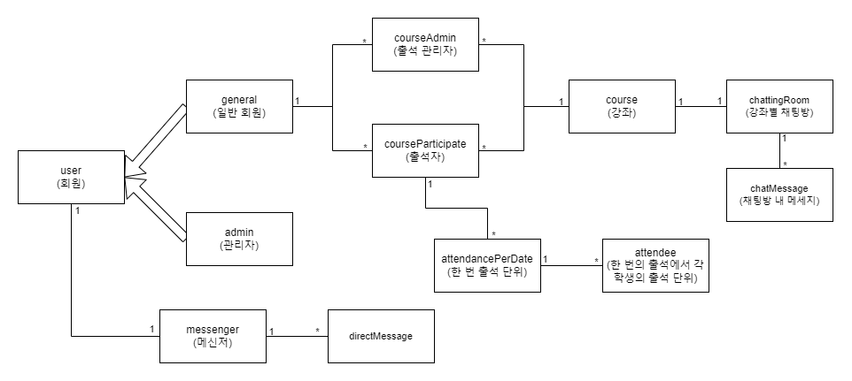
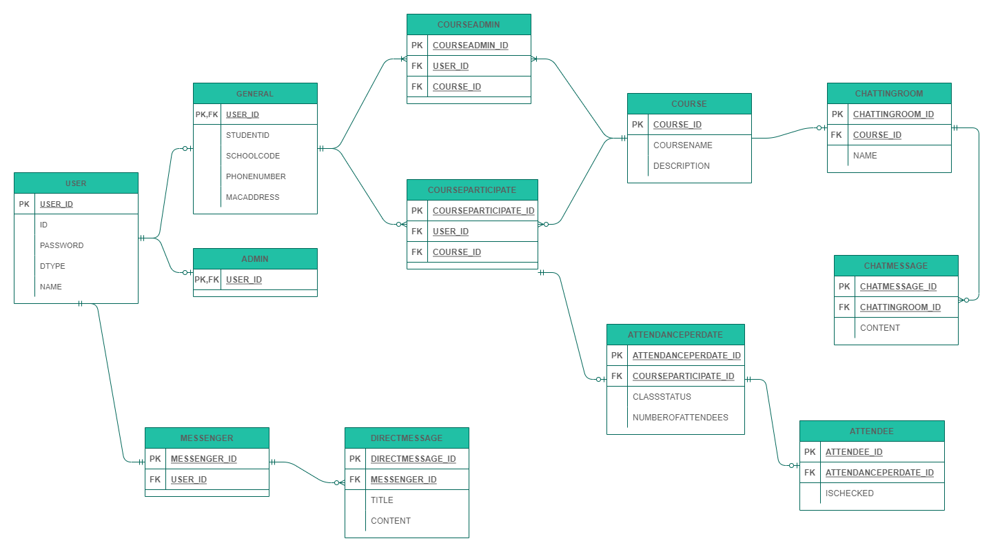

# 도메인 모델과 테이블 설계

## 도메인 모델 설계

### 연관관계 설명
|연관 관계|설명|비고|
|--|--|--|
|user, general, admin|일반 회원과 관리자가 회원을 상속하고 있다||
|general, courseAdmin, courseParticipate|일반 회원과 courseAdmin, courseParticipate는 각각 1 대 다 관계를 가지고 있다. 즉, 일반 회원 한 명은 여러 개의 course를 관리하거나 참여할 수 있다 |일반 회원이 자신이 관리하는 강좌와 자신이 참여하고 있는 강좌를 빠르게 조회할 수 있도록 하기 위해서 다음과 같이 설계|
|course, courseAdmin, courseParticipate|강좌와 출석 관리자, 출석 참여자는 각각 1 대 다 관계를 가지고 있다. 즉, 한 강좌는 여러 명의 출석 관리자와 여러 명의 출석 참여자를 가질 수 있다|출석 관리자가 여러 명이 될 수 있다는 요구사항을 참고하여 설계|
|courseParticipate, attendancePerDate, attendee|courseParticipate, attendeancePerDate, attendee는 1 대 다 관계를 연쇄적으로 갖고 있다. courseParticipate는 일종의 출석부 처럼 활용되며 attendancePerDate는 한 강좌에서 발생하는 여러 수업 각각을 뜻한다. attendee는 한 수업 내에서 각각의 학생들에 대한 출석 정보가 담기게 된다||
|user, messenger, directMessage|모든 user는 하나의 메신저함을 가지고 메신저함 내부에는 여러 개의 DM들이 담기게 된다|일반 회원과 관리자 모두 메신저 기능을 사용할 수 있다|
|course, chattingRoom, chatMessage|강좌와 강좌별 채팅방은 1대1 관계를 가진다. 그리고 한 채팅방 내에서 여러개의 message 각각은 chatMessage이다||

# 테이블 설계
